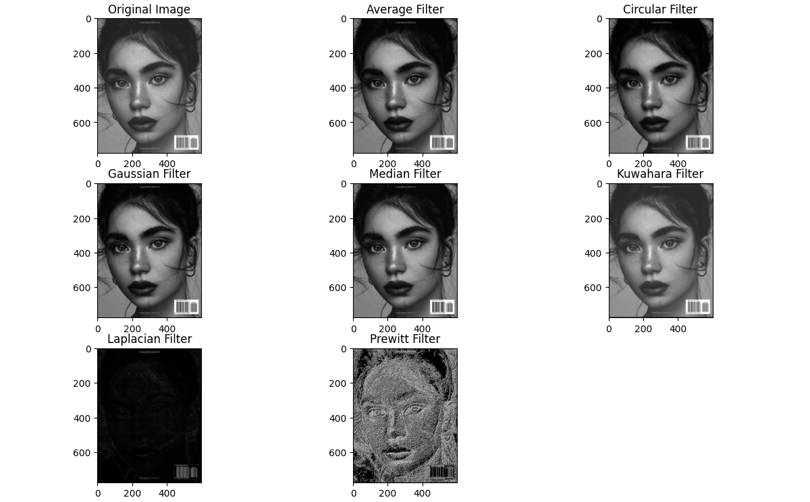

# CV Lecture Assignments: Low & High Pass Filters

## Overview

This document outlines the implementation of low-pass and high-pass filters applied to grayscale images. These filters are fundamental in image processing, used for tasks such as smoothing (low-pass) and edge detection (high-pass). The document covers the following filter techniques: average filter, circular filter, Gaussian filter, median filter, Kuwahara filter, Laplacian filter, and Prewitt filter. The filters are applied to grayscale images, and the results are visualized for comparison.

## Prerequisites

- Python 3.x
- OpenCV (`cv2`)
- NumPy
- SciPy (for median filter)
- Matplotlib (for visualization)

## Functions Description

### 1. Average Filter

The average filter smooths the image by averaging the pixel values in a neighborhood defined by the kernel size. This is a low-pass filter.

```python
def average_filter(image, kernel_size=3):
    return cv2.blur(image, (kernel_size, kernel_size))
```

### 2. Circular Filter

The circular filter applies a circular kernel to the image. It smooths the image but with a circular neighborhood. This is also a low-pass filter.

```python
def circular_filter(image, radius=3):
    kernel = np.zeros((radius * 2 + 1, radius * 2 + 1), dtype=np.float32)
    cy, cx = radius, radius
    for y in range(kernel.shape[0]):
        for x in range(kernel.shape[1]):
            if (y - cy)**2 + (x - cx)**2 <= radius**2:
                kernel[y, x] = 1
    kernel /= np.sum(kernel)
    return cv2.filter2D(image, -1, kernel)
```

### 3. Gaussian Filter

The Gaussian filter is a low-pass filter that smooths the image based on a Gaussian kernel. It reduces noise and blurs the image.

```python
def gaussian_filter(image, kernel_size=5, sigma=1.0):
    kernel = cv2.getGaussianKernel(kernel_size, sigma)
    kernel = kernel @ kernel.T
    return cv2.filter2D(image, -1, kernel)
```

### 4. Median Filter

The median filter is a non-linear filter that replaces each pixel value with the median of the values in its neighborhood. This filter is effective for removing salt-and-pepper noise.

```python
def median_filter_function(image, kernel_size=3):
    return median_filter(image, size=kernel_size)
```

### 5. Kuwahara Filter

The Kuwahara filter is a non-linear filter that segments the image into four regions and selects the one with the least variance to apply smoothing.

```python
def kuwahara_filter(image, kernel_size=5):
    height, width = image.shape
    padding = kernel_size // 2
    output_image = np.zeros_like(image)
    for i in range(padding, height - padding):
        for j in range(padding, width - padding):
            regions = [
                image[i - padding:i + padding + 1, j - padding:j + padding + 1],
                image[i - padding:i + padding + 1, j:j + kernel_size],
                image[i:i + kernel_size, j - padding:j + padding + 1],
                image[i:i + kernel_size, j:j + kernel_size]
            ]
            region_means = [np.mean(region) for region in regions]
            region_variances = [np.var(region) for region in regions]
            min_var_index = np.argmin(region_variances)
            output_image[i, j] = np.mean(regions[min_var_index])
    return output_image
```

### 6. Laplacian Filter

The Laplacian filter is a high-pass filter used to detect edges in an image. It highlights regions of rapid intensity change.

```python
def laplacian_filter(image):
    kernel = np.array([[0, 1, 0],
                       [1, -4, 1],
                       [0, 1, 0]])
    return cv2.filter2D(image, -1, kernel)
```

### 7. Prewitt Filter

The Prewitt filter is used for edge detection, highlighting edges in both the horizontal and vertical directions.

```python
def prewitt_filter(image):
    kernel_x = np.array([[-1, 0, 1],
                         [-1, 0, 1],
                         [-1, 0, 1]])
    kernel_y = np.array([[-1, -1, -1],
                         [0, 0, 0],
                         [1, 1, 1]])
    grad_x = cv2.filter2D(image, -1, kernel_x)
    grad_y = cv2.filter2D(image, -1, kernel_y)
    grad_magnitude = np.sqrt(grad_x**2 + grad_y**2)
    return np.uint8(np.clip(grad_magnitude, 0, 255))
```

## Steps to Execute

1. Place the input grayscale image (`Input Grayscale Photography Of Woman.jpg`) in the same directory as the script.
2. Run the script to apply the filters.
3. The output will display the original image and the results of each filter side by side.

## Example Visualization

### Displayed Images

- **Original Image**
- **Average Filtered Image**
- **Circular Filtered Image**
- **Gaussian Filtered Image**
- **Median Filtered Image**
- **Kuwahara Filtered Image**
- **Laplacian Filtered Image**
- **Prewitt Filtered Image**

### Sample Visualization Code

```python
plt.figure(figsize=(12, 10))

# Original Image
plt.subplot(3, 3, 1), plt.imshow(image, cmap='gray'), plt.title('Original Image')

# Apply and display each filter
plt.subplot(3, 3, 2), plt.imshow(avg_filtered, cmap='gray'), plt.title('Average Filter')
plt.subplot(3, 3, 3), plt.imshow(circular_filtered, cmap='gray'), plt.title('Circular Filter')
plt.subplot(3, 3, 4), plt.imshow(gaussian_filtered, cmap='gray'), plt.title('Gaussian Filter')
plt.subplot(3, 3, 5), plt.imshow(median_filtered, cmap='gray'), plt.title('Median Filter')
plt.subplot(3, 3, 6), plt.imshow(kuwahara_filtered, cmap='gray'), plt.title('Kuwahara Filter')
plt.subplot(3, 3, 7), plt.imshow(laplacian_filtered, cmap='gray'), plt.title('Laplacian Filter')
plt.subplot(3, 3, 8), plt.imshow(prewitt_filtered, cmap='gray'), plt.title('Prewitt Filter')

# Adjust layout and show
plt.tight_layout()
plt.show()
```

### Output Example


## Comparison of Filters

### 1. Average Filter
- **Purpose**: Smooths the image by averaging pixel values.
- **Strengths**: Simple and effective for noise reduction.
- **Weaknesses**: Can blur important details and edges.

### 2. Circular Filter
- **Purpose**: Applies a circular neighborhood for smoothing.
- **Strengths**: Focuses on the central region in a circular manner.
- **Weaknesses**: May not work well for all image structures.

### 3. Gaussian Filter
- **Purpose**: Smooths the image using a Gaussian kernel.
- **Strengths**: Effective for reducing Gaussian noise and smoothing.
- **Weaknesses**: Blurs edges along with noise reduction.

### 4. Median Filter
- **Purpose**: Replaces each pixel with the median value in the neighborhood.
- **Strengths**: Good for removing salt-and-pepper noise.
- **Weaknesses**: May not preserve edges as well as other filters.

### 5. Kuwahara Filter
- **Purpose**: Applies smoothing based on variance in a neighborhood.
- **Strengths**: Preserves edges better than other filters.
- **Weaknesses**: Computationally expensive.

### 6. Laplacian Filter
- **Purpose**: Detects edges in the image by highlighting rapid intensity changes.
- **Strengths**: Excellent for edge detection.
- **Weaknesses**: Can produce noisy results if applied directly to noisy images.

### 7. Prewitt Filter
- **Purpose**: Detects edges using horizontal and vertical gradients.
- **Strengths**: Simple and effective for edge detection.
- **Weaknesses**: Can produce noise if not applied properly.

#### By Ahmed Ibrahim Metwally Negm - ID: 322223887
#### Supervisors: Dr. Shimaa Othman  
Thank you, ✨🤎